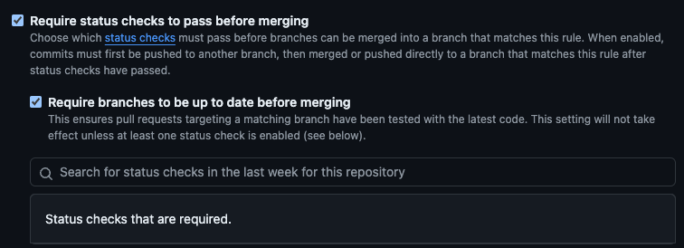

# Montara CI

[](https://github.com/super-linter/super-linter)

[](https://github.com/actions/typescript-action/actions/workflows/check-dist.yml)
[](https://github.com/actions/typescript-action/actions/workflows/codeql-analysis.yml)

## 🤔 What is Montara CI?

Montara CI is a GitHub Action that allows you to execute a pipeline test run in
Montara before merging a pull request. If the pipeline fails, the pull request
can not be merged.

## Getting started

- Create a [Montara account](https://app.montara.io)

- Connect Montara to your data warehouse (see
  [Docs](https://app.montara.io/docs/docs/Settings/#warehouse-connection)).

- Connect Montara to your git repo in the
  [Montara settings page](https://app.montara.io/app/settings?selectedSettingsTab=1)
  (see
  [Docs](https://app.montara.io/docs/docs/Settings/Integrations/dbt/GitHubRepo/)).

- Montara CI triggers a test run via a webhook. Copy the webhook URL from the
  [pipeline settings page](https://app.montara.io/app/pipelines) in Montara.
  

- Create a `ci.yml` file in your `.github/workflows` directory with the
  following content:

- [Recommended] Add a required status check in your repo settings to ensure that
  the pipeline runs successfully before merging a PR.
  

- [Recommended] The test run will run on an isolated schema according to the
  user who created the PR. You can also specify a fallback schema to override
  this behavior if the PR is created outside of Montara.

- [Optional] You can pass variables to the test run by setting the `variables`
  parameter to a JSON object of key-value pairs. for example:

  ```yaml
  variables: '{"var1": "value1", "var2": "value2"}'
  ```

- [Optional] The test run by default will run a Montara smart run. You can
  disable this by setting the `isSmartRun` parameter to `false`.

- [Optional] The test run by default will run in parallel to any pipelines that
  might run at the same time. You can disable this by setting the
  `allowConcurrentPipelineRuns` parameter to `false`.

```yaml
name: Montara CI
on:
  pull_request:
    types: [opened, synchronize, reopened]
permissions:
  contents: read
  issues: write
  pull-requests: write

jobs:
  montara:
    runs-on: ubuntu-latest
    steps:
      - name: Montara CI
        uses: montara-io/montara-ci@v1.0.17
        env:
          GITHUB_TOKEN: ${{ secrets.GITHUB_TOKEN }}
        with:
          webhookUrl: <your-montara-webhook-url>
          fallbackSchema: <[optional]your-fallback-schema>
```

[optional]

```yaml
isSmartRun: <[optional]true|false>
allowConcurrentPipelineRuns: <[optional]true|false>
variables: <[optional]{key: value}>
```

- You're good to go 🚀. Go ahead and create a new PR.

## Contributing to Montara CI

1. Clone the repo `git clone github.com/montara-io/montara-ci`

1. :hammer_and_wrench: Install the dependencies

   ```bash
   npm install
   ```

1. :building_construction: Package the TypeScript for distribution

   ```bash
   npm run bundle
   ```

1. :white_check_mark: Run the tests

   ```bash
   $ npm test

   PASS  ./index.test.js
     ✓ throws invalid number (3ms)
     ✓ wait 500 ms (504ms)
     ✓ test runs (95ms)

   ...
   ```

1. Make your changes
1. Format, test, and build the action

   ```bash
   npm run all
   ```

## Publishing a New Release

- `npm run all`
- `sh ./script/release`
- Find your newly created tag in the
  [tags](https://github.com/montara-io/montara-ci/tags) section of the repo.
- Release the tag.
